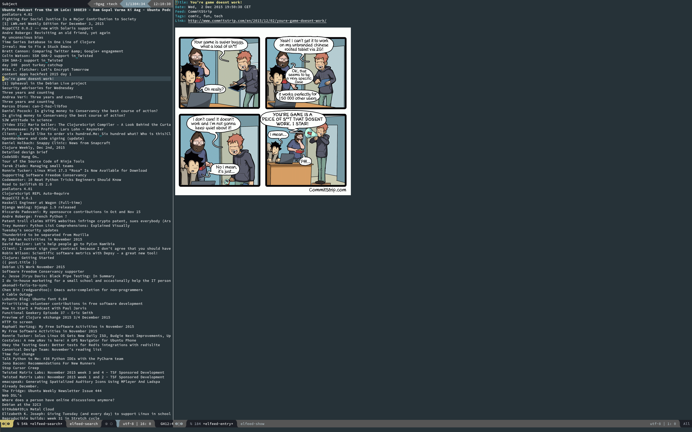

Elfeed goodies
==================

Various bits and pieces to enhance the [Elfeed][elfeed] user experience.




Features
-------

* An adaptive, powerline-based header for the `*elfeed-search*` buffer:
  + Adapts to the window width, so narrow windows will feature more interesting
  information primarily. Most useful with a split-pane setup.
* Split pane setup.
* Easy customisation.

Getting started
------------

```elisp
(require 'elfeed)
(require 'elfeed-goodies)

(elfeed-goodies/setup)
```

You can customise some aspects of the package with `M-x customize-group
elfeed-goodies`.

Copyright & License
------------------------

Copyright (c) 2015 Gergely Nagy, released under the terms of the GNU GPLv3+.
